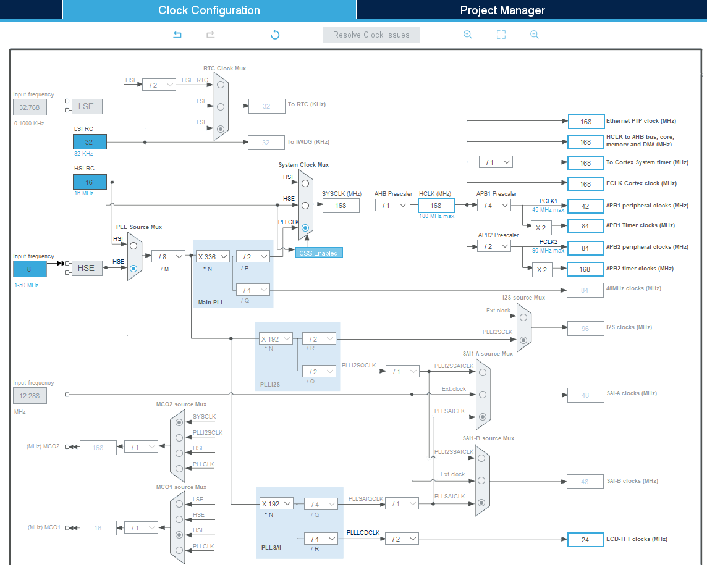
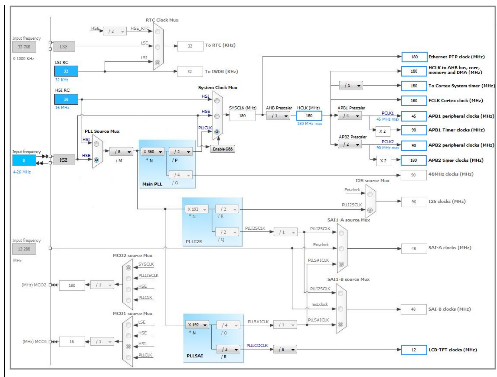

# open_f429_chibios
ChibiOS is well documented and widely used environment for STM32.
This project uses ChibiOS HAL and RT to initialize peripherials and port LVGL graphic library to STM32F429IGT6 Waveshare Core board.
https://www.waveshare.com/wiki/Open429I-C

TODO list:
- [ ] Migrate from STM32 HAL LVGL port completely [link](https://github.com/Yuribadz/f429_lvgl)
- [x] Add Debug port printout using PL2302 and USART1 connected to it
- [x] Create Debug info with system configuration
- [x] Add O-Zone support
- [x] Create o-zone script that supports ChibiOS
- [x] Create c_cpp_properties.json for project Win/Linux
- [ ] Initialize FMC
- [ ] Initialize SDRAM
- [ ] Initialize LTDC
- [ ] Initialize DMA2D
- [ ] Create integration script for Squareline studio
- [ ] Create import script for LVGL ui files
- [x] Create compatible simulator for LVGL using SDL2 [fork of LVGL port](https://github.com/Yuribadz/lv_port_cmake)
- [x] Create Cortex Debug configuration
- [ ] Many more

## 1. Installation
  - Install make, arm-none-eabi in your system and add it to your PATH
  - Install ST-LINK drivers or J-LINK drivers depending on your debug probe
  - O-Zone or other segger tools are optional
  - Project can be imported into STM32CUBEIDE using .cproject and .project files. To compile and use it successfully you must select ARM GCC in project settings as your toolchain.
  - Project can be also imported into ChibiStudio as existing project. Diselect all projects and use only open_f429_chibios
  - Project can be used with vscode and supports intellisense better than CubeIDE from ST or Eclipse based IDEs. Folder .settings contains c_cpp_properties.json that can be adjusted to fit your install path.
  - I am using both Cortex-Debug extension and O-Zone debugger community license to debug software because J-Link FEELS way faster than ST-LINK V3SET. Folder debug contains all necessary files to debug board.

## 2. Adapting your board
- ChibiOS has wide range of tools to import your configuration from STM32CUBE generated project. Use chibios2111\community\tools\mx2board.py or any other script.
- Most configuration is stored in board.c and board.h file and config folder of project.
- ChibiOS has extensive documentation.
- Adjust configuration to your needs. For current project template chibios2111/os/hal/boards/ST_STM32F429I_DISCOVERY was used. OpenF429IGT6 Core board is LQFP176 MCU with 176 pins, while Discovery has 144 pins. Additional pins can handle more peripherials.
- General recomendation from ChibiOS documentation is to incrementally add small changes and test them.

## 3. Testing
- Unity test framework will be used as unit test for this project
- fff for component test

## 4. Clock configuration
### 1. Reference design by ChibiOS port for STM32F429 DISCO

### 2. Reference design by WaveShare demo

## 5. Board peripherials
### 1. FMC controller and SDRAM GPIO configuration

FMC GPIO configuration
| Pin  | FMC Signal   | Mode | Speed  | GPIO Pull-up/Pull-down|
|------|--------------|------|------- |-----------------------|
| PD0  | FMC_D2       | AF 12   | 50 Mhz | No pull               |
| PD1  | FMC_D3       | AF 12   | 50 Mhz | No pull               |
| PD8  | FMC_D13      | AF 12   | 50 Mhz | No pull               |
| PD9  | FMC_D14      | AF 12   | 50 Mhz | No pull               |
| PD10 | FMC_D15      | AF 12   | 50 Mhz | No pull               |
| PD14 | FMC_D0       | AF 12   | 50 Mhz | No pull               |
| PD15 | FMC_D1       | AF 12   | 50 Mhz | No pull               |
| PE0  | FMC_NBL0     | AF 12   | 50 Mhz | No pull               |
| PE1  | FMC_NBL1     | AF 12   | 50 Mhz | No pull               |
| PE7  | FMC_D4       | AF 12   | 50 Mhz | No pull               |
| PE8  | FMC_D5       | AF 12   | 50 Mhz | No pull               |
| PE9  | FMC_D6       | AF 12   | 50 Mhz | No pull               |
| PE10 | FMC_D7       | AF 12   | 50 Mhz | No pull               |
| PE11 | FMC_D8       | AF 12   | 50 Mhz | No pull               |
| PE12 | FMC_D9       | AF 12   | 50 Mhz | No pull               |
| PE13 | FMC_D10      | AF 12   | 50 Mhz | No pull               |
| PE14 | FMC_D11      | AF 12   | 50 Mhz | No pull               |
| PE15 | FMC_D12      | AF 12   | 50 Mhz | No pull               |
| PF0  | FMC_A0       | AF 12   | 50 Mhz | No pull               |
| PF1  | FMC_A1       | AF 12   | 50 Mhz | No pull               |
| PF2  | FMC_A2       | AF 12   | 50 Mhz | No pull               |
| PF3  | FMC_A3       | AF 12   | 50 Mhz | No pull               |
| PF4  | FMC_A4       | AF 12   | 50 Mhz | No pull               |
| PF5  | FMC_A5       | AF 12   | 50 Mhz | No pull               |
| PF11 | FMC_NRAS     | AF 12   | 50 Mhz | No pull               |
| PF12 | FMC_A6       | AF 12   | 50 Mhz | No pull               |
| PF13 | FMC_A7       | AF 12   | 50 Mhz | No pull               |
| PF14 | FMC_A8       | AF 12   | 50 Mhz | No pull               |
| PF15 | FMC_A9       | AF 12   | 50 Mhz | No pull               |
| PG0  | FMC_A10      | AF 12   | 50 Mhz | No pull               |
| PG1  | FMC_A11      | AF 12   | 50 Mhz | No pull               |
| PG8  | FMC_SDCLK    | AF 12   | 50 Mhz | No pull               |
| PG15 | FMC_NCAS     | AF 12   | 50 Mhz | No pull               |
| PH7  | FMC_SDCKE1   | AF 12   | 50 Mhz | No pull               |
| PH6  | FMC_SDNE1    | AF 12   | 50 Mhz | No pull               |
| PH5  | FMC_SDNWE    | AF 12   | 50 Mhz | No pull               |
